<p align="center">
  
</p>

<h1 align="center">Securia</h1>

<p align="center">
  <strong>Pide ayuda en segundos y mira llegar a la patrulla. El agente recibe la alerta a pantalla completa y la atiende con un solo botón.</strong><br>
  Dos apps en Flutter para seguridad ciudadana en Lima: una para el ciudadano y otra para la unidad de patrullaje (PNP o serenazgo), con un paquete compartido.
</p>

<p align="center">
  <a href="https://flutter.dev"></a>
  <a href="https://dart.dev"></a>
  
  
  
  
  
</p>

---

## 📱 Capturas de Pantalla (Preview)

> Capturas tomadas en el simulador de iOS: la app ciudadana en un iPhone 17 Pro Max y la policial en un iPhone 17 Pro. Los nombres, DNI, teléfonos y direcciones son **datos ficticios**.

### Ciudadano · Acceso y mapa

| 01. Inicio de sesión | 02. Crear cuenta | 03. Mapa |
| :---: | :---: | :---: |
| 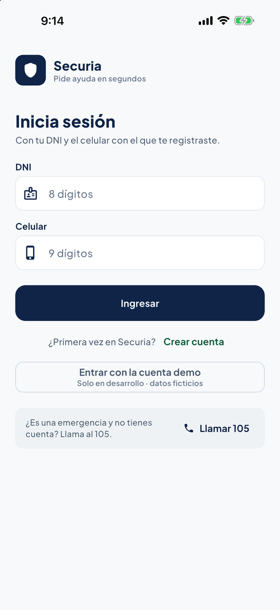 | 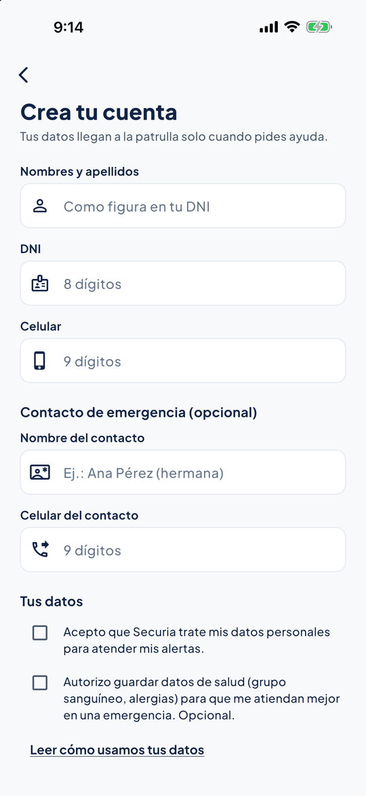 | 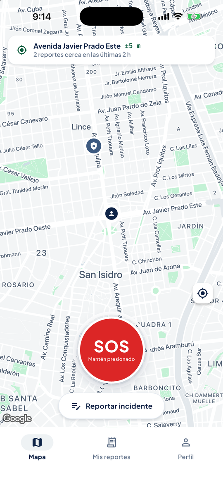 |
| *DNI y celular; si es una emergencia*<br>*sin cuenta, llama al 105* | *Consentimiento de datos (Ley 29733);*<br>*el de salud es aparte y opcional* | *Tu ubicación real con su margen;*<br>*el SOS es lo único rojo* |

### Ciudadano · Pedir ayuda

| 04. Reportar incidente | 05. Alerta enviada | 06. Seguimiento |
| :---: | :---: | :---: |
| 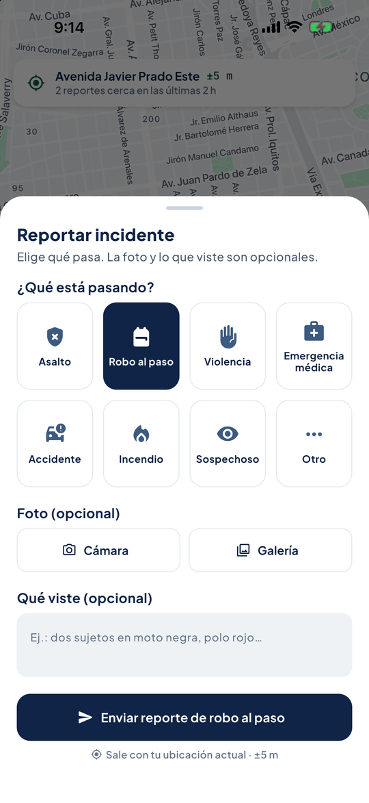 | 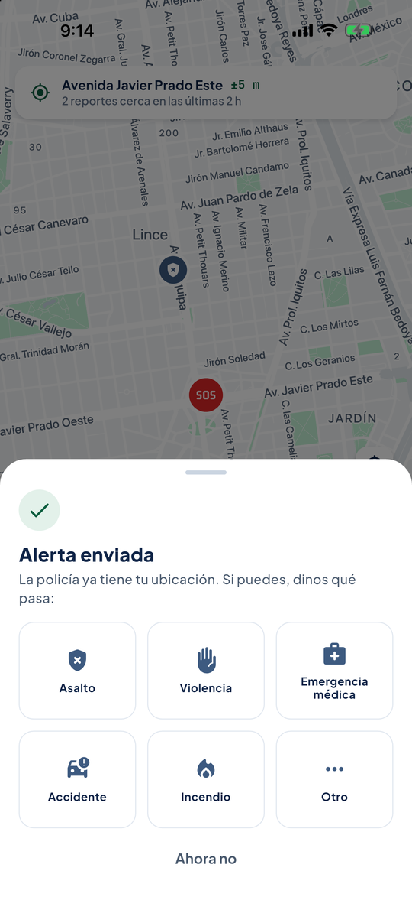 | 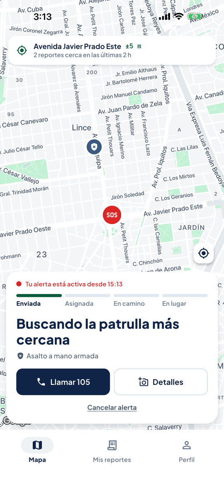 |
| *Eliges qué pasa; la foto y lo*<br>*que viste son opcionales* | *El SOS sale primero; después,*<br>*si puedes, dices qué pasa* | *Enviada, asignada, en camino y*<br>*en lugar, con Llamar 105* |

### Ciudadano · Historial y perfil

| 07. Mis reportes | 08. Detalle | 09. Perfil |
| :---: | :---: | :---: |
| 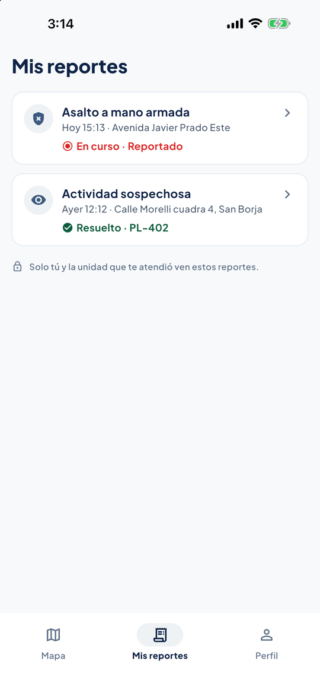 | 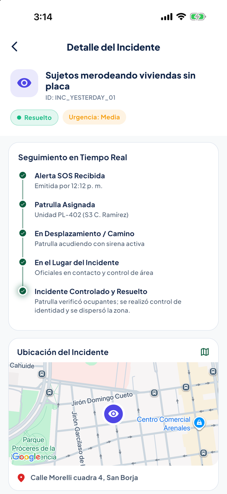 | 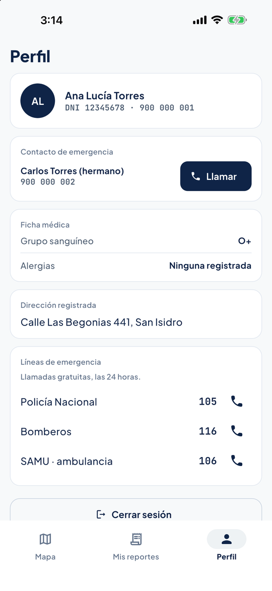 |
| *Los tuyos, con su estado y*<br>*la unidad que te atendió* | *Cada paso de la atención y*<br>*el lugar en Google Maps* | *Contacto de emergencia, ficha médica*<br>*(si la autorizaste) y líneas 105, 116 y 106* |

### Patrullero · Atender una alerta

| 10. Inicio de guardia | 11. Alerta entrante | 12. En camino |
| :---: | :---: | :---: |
| 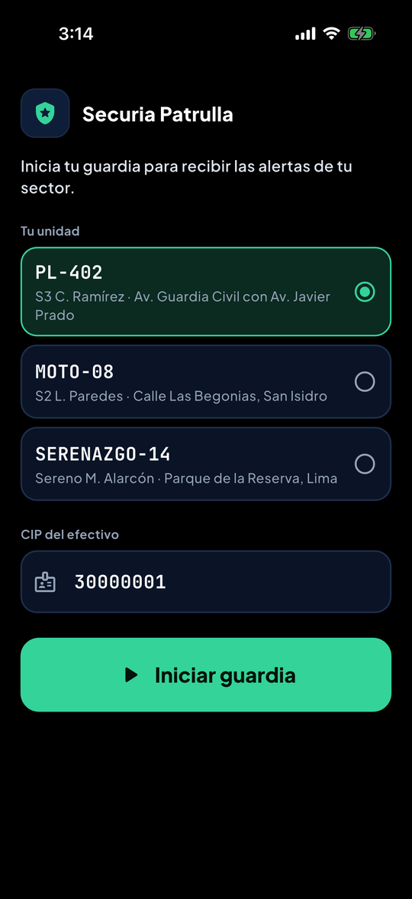 | 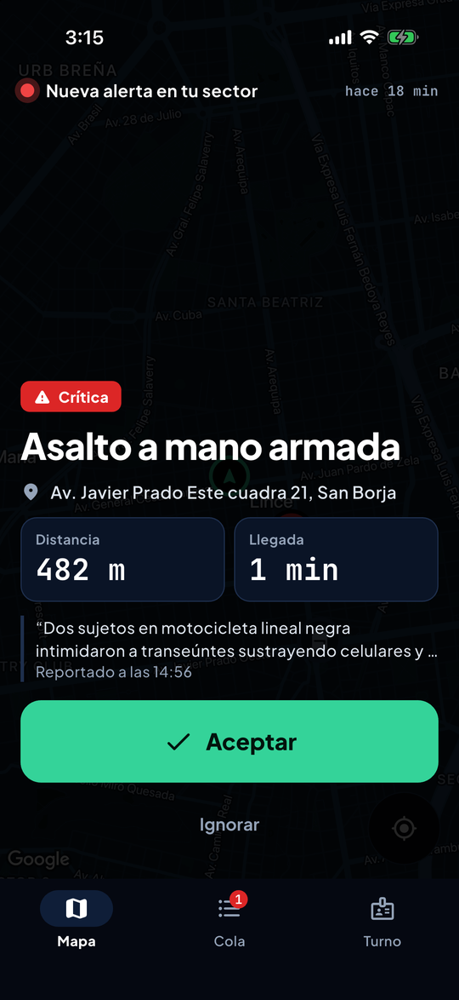 | 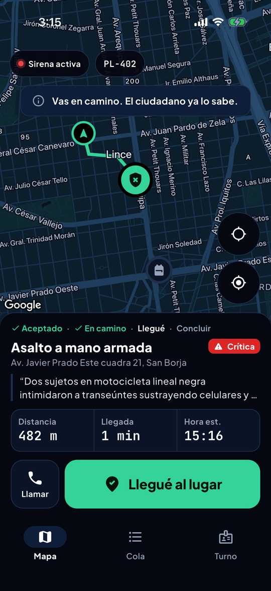 |
| *Eliges tu unidad, escribes*<br>*tu CIP e inicias* | *Urgencia, qué pasa, dónde y a cuánto;*<br>*se lee en 2 segundos* | *Mapa nocturno, ruta y un solo*<br>*botón con el siguiente paso* |

### Patrullero · Cierre, cola y turno

| 13. Cierre rápido | 14. Cola de despacho | 15. Turno |
| :---: | :---: | :---: |
| 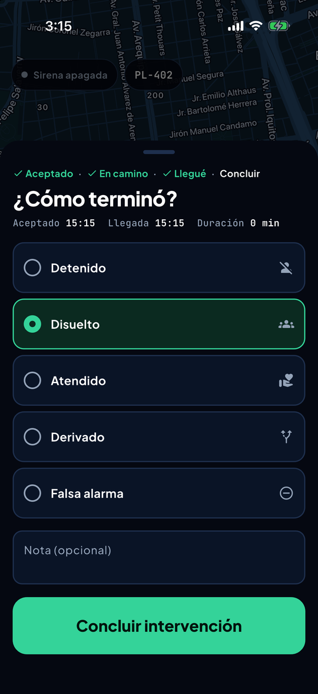 | 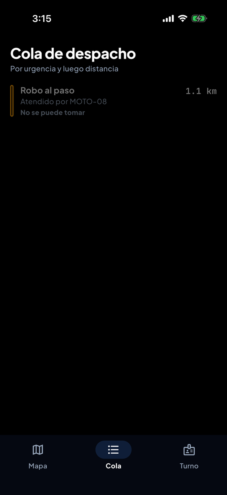 | 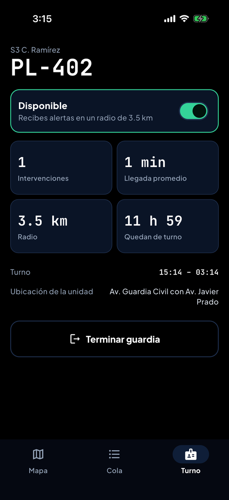 |
| *Las horas del caso arriba y cinco*<br>*resultados de 64 px para guantes* | *Por urgencia y luego distancia;*<br>*lo que atiende otra unidad, atenuado* | *Disponible o fuera de servicio,*<br>*y las cifras reales de la guardia* |

---

## ⚡ Características Principales

### 🚨 App del ciudadano (`securia_citizen`)

- **🆘 SOS al mantener presionado 1,5 s.** Un anillo se llena, el teléfono vibra y la pantalla se oscurece con «Suelta para cancelar»: así no sale una alerta desde el bolsillo. La alerta sale **antes** de preguntar nada; luego, si puedes, eliges qué pasa.
- **📝 Reportar incidente con detalle.** Tipo (obligatorio), foto con cámara o galería y lo que viste (opcionales). La urgencia la pone el tipo: asalto, violencia, incendio o emergencia médica son críticas; robo o accidente, altas; actividad sospechosa, media.
- **📍 Ubicación real.** GPS con dirección legible y su margen (`±5 m`). Si la ubicación es imprecisa (más de 50 m o más de 2 minutos) o no hay permiso, lo dice, ofrece corregirlo y el segundo botón pasa a **Llamar 105**. El SOS nunca se desactiva.
- **🛰️ Seguimiento.** Pasos Enviada → Asignada → En camino → En lugar, con **Llamar 105**, **Detalles** (foto u observación después de enviar) y **Cancelar alerta** con confirmación. Con la alerta activa, el gesto atrás no cierra la pantalla.
- **🔐 Cuenta y consentimiento.** Inicio de sesión con DNI y celular, registro y cierre de sesión. Al registrarse se acepta el tratamiento de datos (Ley 29733); el permiso para guardar datos de salud es aparte y opcional, y la ficha médica solo se muestra si se dio.
- **🗂️ Mis reportes.** Historial con estado y la unidad que atendió; el detalle muestra cada paso y el lugar en Google Maps.
- **👤 Perfil.** Contacto de emergencia con llamada directa, ficha médica y líneas gratuitas (105 Policía, 116 Bomberos, 106 SAMU).

### 🚓 App del patrullero (`securia_patrol`)

- **📣 Alerta entrante a pantalla completa.** En el orden en que se decide: urgencia, qué pasa, dónde, distancia y llegada. **Aceptar** mide 72 px de alto. Entra con un solo pulso (sin parpadeo que distraiga al manejar), vibra, suena y se anuncia al lector de pantalla. «Ignorar» dice cuántas alertas más esperan.
- **🟢 Un solo botón que avanza la intervención,** siempre en el mismo lugar: **Aceptar → Voy en camino → Llegué al lugar → Concluir intervención**. La sirena se enciende al salir y se apaga al llegar; el ciudadano ve cada paso.
- **🌙 Mapa nocturno real** con un estilo oscuro de Google Maps (no tiles invertidos), la ruta hasta el incidente y el radio de cobertura.
- **✅ Cierre rápido.** Las horas de aceptación y llegada y la duración del caso ya vienen escritas; se elige el resultado (Detenido, Disuelto, Atendido, Derivado o Falsa alarma) y una nota opcional.
- **📋 Cola de despacho** ordenada por urgencia y luego por distancia. Lo que atiende otra unidad queda atenuado con «Atendido por MOTO-08» y no se puede tomar dos veces.
- **⏱️ Turno.** El código de la unidad en grande, el interruptor **Disponible** (fuera de servicio no recibe alertas) y cifras reales de la guardia: intervenciones, llegada promedio, radio y tiempo restante del turno.
- **📞 Llamar al ciudadano** a un toque durante toda la intervención. Si el ciudadano cancela, la unidad queda libre y recibe el aviso.

### 🎨 Sistema de diseño «Sereno»

- **Un color, un trabajo.** En la app ciudadana el rojo es solo el SOS y tu alerta activa; los incidentes de otros van en azul neutro. En la policial el verde es la acción principal y el rojo la urgencia crítica.
- **Urgencia legible sin color:** crítica en bloque sólido, alta con contorno y media punteada, siempre con la palabra.
- **Tipografía empaquetada** (funciona sin internet): Plus Jakarta Sans para el texto y JetBrains Mono con cifras tabulares para distancias, tiempos y códigos de unidad (`PL-402`), para que los números no «bailen» al actualizarse.
- **Accesibilidad:** áreas táctiles de 48 px (64 px en la app policial, por los guantes), `Semantics` en el SOS, marcadores, tipos y botones de despacho, respeto de «reducir movimiento» y texto grande sin que se rompa la pantalla.
- **Textos en tipo oración** («Llegué al lugar»), sin MAYÚSCULAS ni jerga.

---

## 🏗️ Arquitectura y Tecnologías

Flutter 3.29 (Dart 3.7), flutter_bloc (BLoC y Cubit), get_it, google_maps_flutter, geolocator, geocoding, flutter_animate, animations, image_picker, url_launcher e intl. Es un monorepo con dos apps y un paquete compartido; el repositorio expone `Stream`s, así que un backend real solo tiene que implementar `ISecuriaRepository`.

```text
securia/
├── securia_core/                      # Paquete compartido
│   ├── assets/fonts/                  # Plus Jakarta Sans y JetBrains Mono (con sus licencias)
│   ├── lib/
│   │   ├── design/                    # Tokens Sereno (espaciado, radios, motion, urgencia) y SecuriaMap
│   │   ├── models/                    # Incidente, patrulla, ciudadano (con consentimientos) y enums
│   │   ├── repository/                # ISecuriaRepository e InMemorySecuriaRepository (datos semilla ficticios)
│   │   └── utils/                     # GeoUtils: distancia, tiempo de llegada y rutas urbanas
│   └── test/                          # Ciclo del incidente, sesión y despacho
│
├── securia_citizen/                   # App del ciudadano
│   ├── lib/
│   │   ├── app/                       # Tema, textos, estilo de mapa e inyección de dependencias
│   │   └── features/
│   │       ├── auth/                  # Inicio de sesión, registro y consentimiento
│   │       ├── home/                  # Navegación inferior (Mapa, Mis reportes, Perfil)
│   │       ├── map/                   # GPS, SOS, reporte con detalle y seguimiento
│   │       ├── history/               # Mis reportes y detalle con mapa
│   │       └── profile/               # Contactos, ficha médica y cierre de sesión
│   └── test/                          # BLoC, widgets y flujos completos
│
├── securia_patrol/                    # App del patrullero
│   ├── lib/
│   │   ├── app/                       # Tema oscuro, estilo de mapa nocturno, textos y componentes
│   │   └── features/
│   │       ├── auth/                  # Inicio de guardia
│   │       ├── shell/                 # Navegación (Mapa, Cola, Turno)
│   │       ├── tactical_map/          # Mapa, alerta entrante, ficha de intervención y cierre
│   │       ├── queue/                 # Cola de despacho
│   │       ├── shift/                 # Turno y estado de servicio
│   │       └── catalog/               # Catálogo de componentes (para desarrollo)
│   └── test/                          # BLoC, componentes y flujo de despacho completo
│
├── docs/                              # Logo y capturas
└── .env.example                       # Plantilla de la clave de Google Maps
```

---

## 🚀 Comenzando

### Requisitos Previos

- **Flutter 3.29** o superior (Dart 3.7).
- **iPhone:** Xcode con un simulador de iOS (solo en macOS).
- **Android:** Android Studio con el SDK de Android y un emulador o teléfono.
- Una **clave de Google Maps** con *Maps SDK for iOS* y *Maps SDK for Android* habilitados.

### 1. Clonar el repositorio

```bash
git clone https://github.com/VMichael1999/Securia.git
cd Securia
```

### 2. Variables de entorno

Copia `.env.example` a `.env` en la raíz del repositorio y escribe tu clave. El `.env` no se sube al repositorio.

```bash
cp .env.example .env
```

```env
MAPS_API_KEY=tu_clave_de_google_maps
```

Las dos apps leen la clave al compilar: iOS por `ios/Flutter/*.xcconfig` (que incluye el `.env`) e `Info.plist`, y Android desde `android/app/build.gradle.kts`. No hace falta `--dart-define`. Conviene restringir la clave en Google Cloud a los identificadores de las apps.

### 3. Instalar dependencias

```bash
cd securia_core && flutter pub get
cd ../securia_citizen && flutter pub get
cd ../securia_patrol && flutter pub get
```

---

## 💻 Ejecución del Proyecto

### App del ciudadano

```bash
cd securia_citizen
flutter run -d "iPhone 17 Pro Max"
```

En modo *debug*, **Entrar con la cuenta demo** inicia sesión con el ciudadano ficticio de los datos semilla. También puedes crear una cuenta nueva.

### App del patrullero

```bash
cd securia_patrol
flutter run -d "iPhone 17 Pro"
```

En modo *debug* el CIP ya viene escrito: toca **Iniciar guardia** con la unidad `PL-402` y aparecerá la alerta pendiente de los datos semilla.

---

## 🧪 Pruebas y Calidad de Código

```bash
flutter analyze
flutter test
```

Se corren en cada paquete:

| Paquete | Pruebas | Qué cubren |
| --- | :---: | --- |
| `securia_core` | 16 | Ciclo del incidente, sesión del ciudadano, consentimientos y que dos unidades no tomen el mismo incidente |
| `securia_citizen` | 46 | Inicio de sesión, registro con consentimiento, SOS al mantener presionado, reporte con detalle, GPS preciso, impreciso y sin permiso, seguimiento y cancelación |
| `securia_patrol` | 48 | Alerta entrante, flujo completo con un solo botón, cierre, cola, turno, tiempos de la guardia y catálogo |

### Estado de las pruebas

```text
securia_core:     16 passed, 0 failed
securia_citizen:  46 passed, 0 failed
securia_patrol:   48 passed, 0 failed
Análisis:         sin problemas
```

En las pruebas, Google Maps se reemplaza por un mapa falso (`SecuriaMap.debugUseFakeMap`) y el GPS por `FakeLocationService`.

---

## 🔑 Permisos

- **Ubicación (solo en uso), app del ciudadano:** para mandar la alerta con tu posición real. Sin permiso, la app lo explica y ofrece llamar al 105.
- **Cámara y fotos, app del ciudadano:** solo al adjuntar una foto a un reporte.
- **Teléfono:** abre el marcador para llamar al 105, al contacto de emergencia o, desde la app policial, al ciudadano.

---

## 📌 Guía de Uso (probar el flujo completo)

1. **Ciudadano:** entra con la cuenta demo, mantén presionado **SOS** 1,5 s y elige qué pasa (o «Ahora no»). Verás el seguimiento con la alerta activa.
2. **Reporte con detalle:** toca **Reportar incidente**, elige el tipo, agrega una foto u observación y envía.
3. **Patrullero:** inicia la guardia con `PL-402`; aparece la alerta entrante. Toca **Aceptar** y avanza con el mismo botón: **Voy en camino → Llegué al lugar → Concluir intervención**.
4. **Cierre:** elige el resultado y concluye. En **Turno** verás la intervención contada y la llegada promedio.

> Cada app tiene su propio repositorio en memoria: el SOS que mandas desde el ciudadano no llega todavía a la app policial en otro dispositivo (ver abajo).

---

## 🚧 Lo que todavía no hace

- **Sin backend:** `InMemorySecuriaRepository` vive dentro de cada app. Las cuentas nuevas y los incidentes se pierden al cerrarla y **las dos apps no se comunican entre dispositivos**. Para producción falta un backend (Firebase, Supabase o WebSocket) que implemente `ISecuriaRepository`; las pantallas no cambian.
- **Ubicación de la patrulla:** la unidad está en un punto fijo de los datos semilla; todavía no usa el GPS del teléfono.
- **Sin conexión:** faltan los estados «Sin conexión: llama al 105» (con la alerta en cola y reintento) y «el proveedor de mapas no responde».
- **Verificación del celular:** el acceso valida DNI y celular contra los datos registrados; en producción conviene confirmar el celular con un código SMS.
- **Android:** las dos apps compilan con la clave desde `.env`, pero el rediseño se revisó en el simulador de iOS.

---

## 👥 Contribución y Créditos

Desarrollado por **Michael Valdiviezo**.

- **Repositorio:** [VMichael1999/Securia](https://github.com/VMichael1999/Securia)
- **Rama principal:** `master`

---

<p align="center">
  <b>Securia</b> · Primero se envía, después se completa 🛡️
</p>
